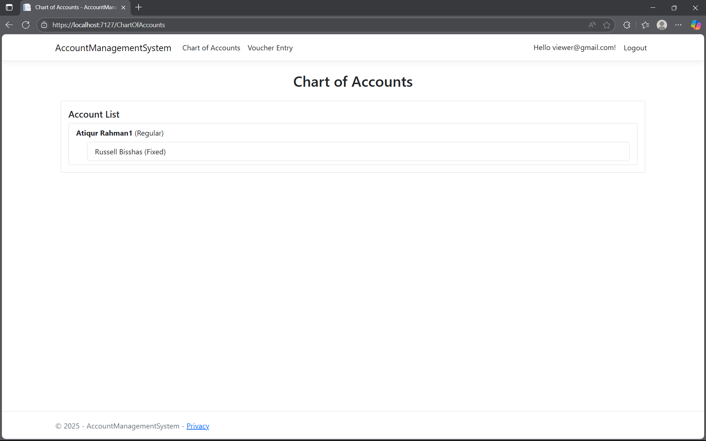
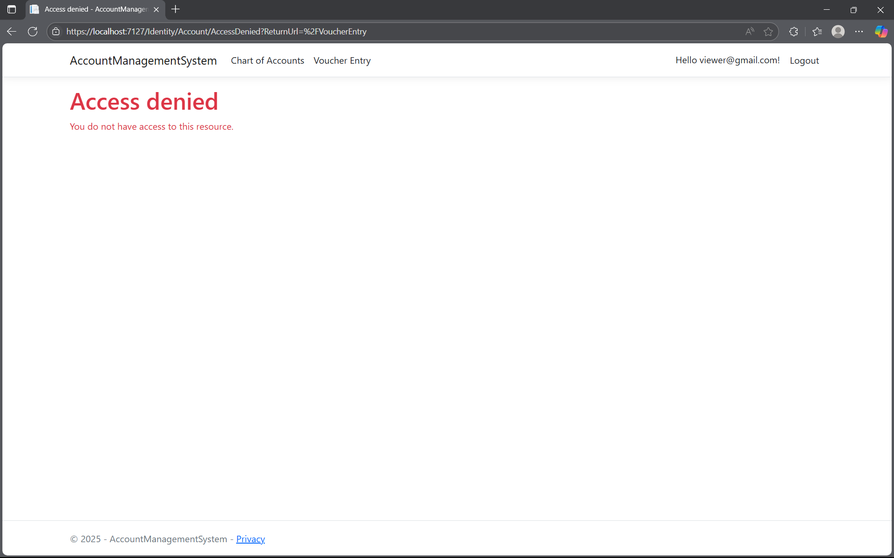
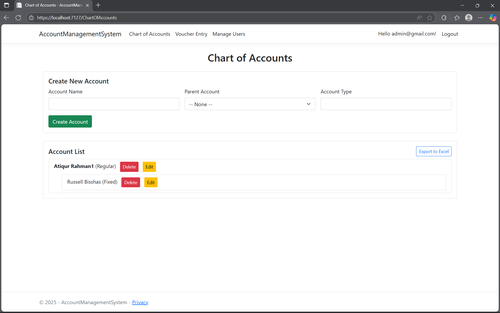
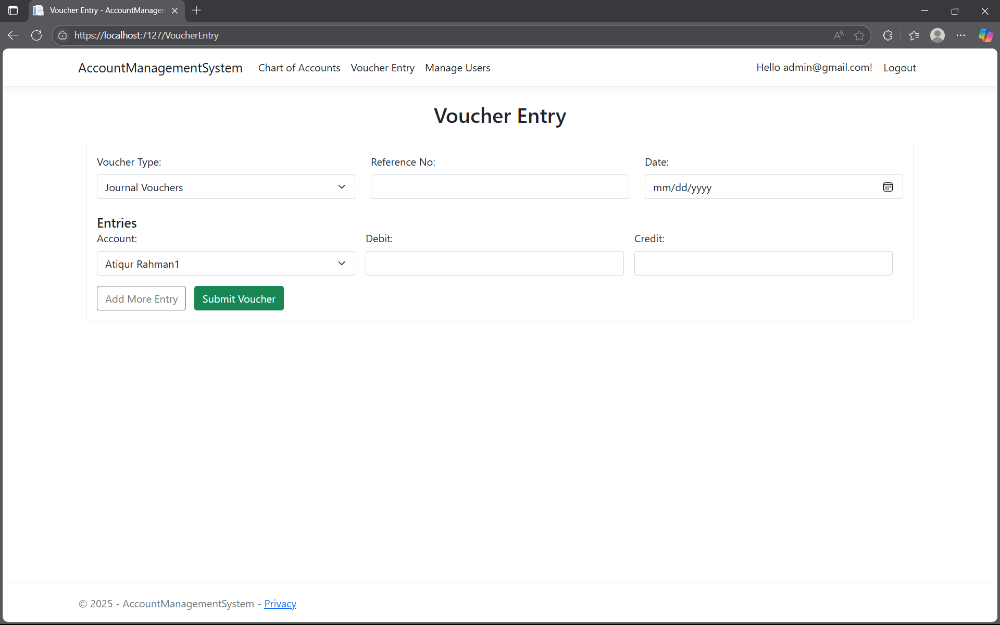
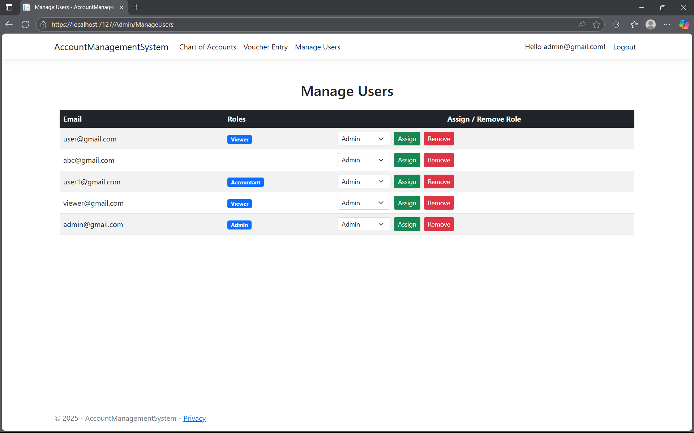

# Mini Account Management System

This is a simple account management system built with **ASP.NET Core Razor Pages**, **MS SQL Server**, and **Stored Procedures**. It includes role-based authentication and Excel export using EPPlus.

## 🧩 Features

- Admin/Accountant/Viewer login system using ASP.NET Identity
- Manage Chart of Accounts (Create, Update, Delete)
- Stored Procedure: `sp_ManageChartOfAccounts`
- Export Chart of Accounts to Excel file
- Role-based authorization
- Three-layer architecture

## Important Notes
- to register an account first fillup the form and submit, then confirm the registration by clicking "Click here to confirm your account", then login
- to login as admin use this email "admin@gmail.com" and password "123456aA@" (use the same password pattern throughout the project)
- login as admin and assign roles to newly added account (without assigning role by admin no one can access anything)
- after assigning roles by admin, login with viewer or accountent email
- now Admin is able to Manage Users, CRUD Accounts, Export Excel File, Entry Vouchers
- Accountent is able to CRUD Accounts, Export Excel File, Entry Vouchers
- and Viewer is able to see Account list only

## 📸 Screenshots

### Account List (Viewer)

### Access Denied (Viewer)

### Account CRUD and List , Exported Excel (Admin, Accountent)

### Voucher Entry (Admin, Accountent)

### Manage Users Page (Only for Admin)

## 🛠️ Technologies Used

- ASP.NET Core Razor Pages
- MS SQL Server
- EPPlus (for Excel export)
- Identity for login and role management
- ADO.NET with stored procedures
- HTML/CSS for simple UI

